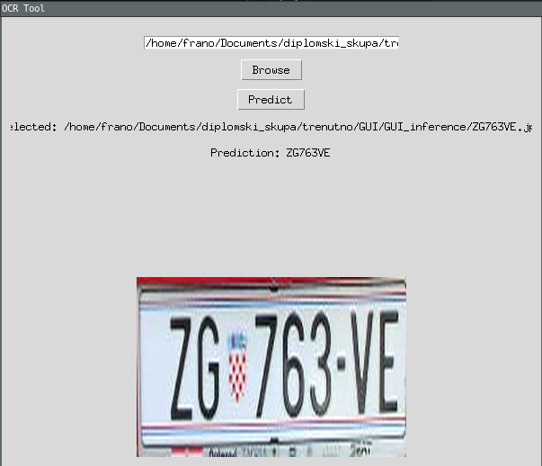

# Licence plate object detection and character recognition
### Works well only on Croatian (hr, cro) registration plates
For code to work on other plates train the model on about 500 images.

Sources:
* https://keras-ocr.readthedocs.io/en/latest/
* https://github.com/data-prestige/train-keras-ocr
